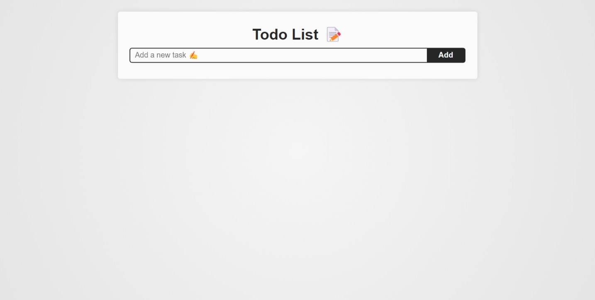

# Todo List en Vue ✅📝

A simple and efficient application to manage your daily tasks with Vue.js. Easily add, delete, and mark tasks as completed. 📋✨

## Features 🚀

- ➕ Add new tasks.
- ✅ Mark tasks as completed.
- 🗑️ Delete tasks.
- 📱 User-friendly and responsive interface.

## Contributions 🤝

Contributions are welcome! To collaborate, follow these steps:

1. 🔄 Fork the repository.
2. 🌱 Create a new branch with your feature or bug fix.
3. 🚀 Submit a pull request.

## License 📜

This project is licensed under the MIT License. 🏆
